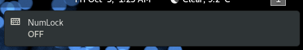

# gnome-numlock-notifier

Script to monitor the state of the `NumLock` key and notify the user whenever it changes.

## Motivation

I bought a new laptop which has a numerical keypad (no, I don´t like numerical keypads, but that was the model that was in stock). Obviously the keypad's behaviour changes depending on the state of the `NumLock` key, however the laptop came with no LEDs to indicate when that key is On or Off.

That proved to be annoying because I was constantly getting a 7 when I pressed the `Home` key, or a 1 when I pressed the `End` key, etc. That's why I decided to develop this script, so now I get instant feedback about the `NumLock` state whenever I press it. :)

## Prerequisites

This script was written in [BASH](https://www.gnu.org/software/bash/) which should come pre-installed on almost all Linux distributions. It depends on [Gnome's GLib](https://developer.gnome.org/glib/) (`gsettings`) and [Gnome's libnotify](https://developer.gnome.org/libnotify/) (`notify-send`).

It was successfully tested on a [Fedora](https://getfedora.org/) 31 Workstation running GNU BASH 5.0.7, GLib 2.62.1 and libnotify 0.7.8.

* For other Linux distributions you might want to adjust the the path to the `input-keyboard-symbolic.svg` file inside the shell script, because it will likely be different.

## Installing

Note: the brief instructions below assume the reader has some basic knowledge of how to use a Linux Desktop system running [Gnome](https://www.gnome.org/).

Simply copy the `io.techwords.numlock-notifier.desktop` file into the `${HOME}/.config/autostart` directory and the `numlock-notifier.sh` script into a directory of your choice (suggestion: `${HOME}/bin`), set the execute permission on the `.sh` script (e.g. `chmod u+x numlock-notifier.sh`), and adjust the `Exec=` line inside the `.desktop` file so it points to where you copied the `.sh` script. Restart Gnome or reboot your computer.

## Testing

The easiest way to test this, after restarting Gnome or your computer, is simply pressing the `NumLock` key on your keyboard and see if you get a notification at the top of your screen like the one shown below:



You can also check if the necessary processes are running by executing the following command:

```
$ pstree -aT $(pgrep -x flock)
```

You should then see something like the following:

```
flock -en /run/user/1000/numlock-notifier.lock /home/me/bin/numlock-notifier.sh
  └─numlock-notifie /home/me/bin/numlock-notifier.sh
      └─gsettings monitor org.gnome.desktop.peripherals.keyboard numlock-state
```

Moreover, you can check if the two necessary files were also created by executing the following command:

```
$ ls -F ${XDG_RUNTIME_DIR:-/tmp}/numlock-notifier*
```

Which should produce something like the following output:

```
/run/user/1000/numlock-notifier|  /run/user/1000/numlock-notifier.lock
```

## Usage

If the tests above succeeded there is nothing else to do. Simply press the `NumLock` key and get a desktop notification indicating its current status.

The `.sh` script uses a lock file to prevent multiple instances of itself. It also cleans-up after itself if it's terminated so no files should be left on the system if it's not running. The `gsettings` command continuously monitor the state of `NumLock` and sends any changes into a FIFO file which is continuously polled by the `.sh` script. The `.sh` script generates a desktop notification using `notify-send` whenever it reads a change from the FIFO file.

## Tweak

More visible notifications can be achieved by replacing `notify-send` with [`zenity`](https://wiki.gnome.org/Projects/Zenity) (Gnome) or [`kdialog`](https://userbase.kde.org/Kdialog) (KDE).

## License

This project is licensed under the MIT License - see the [LICENSE](LICENSE) file for details.

